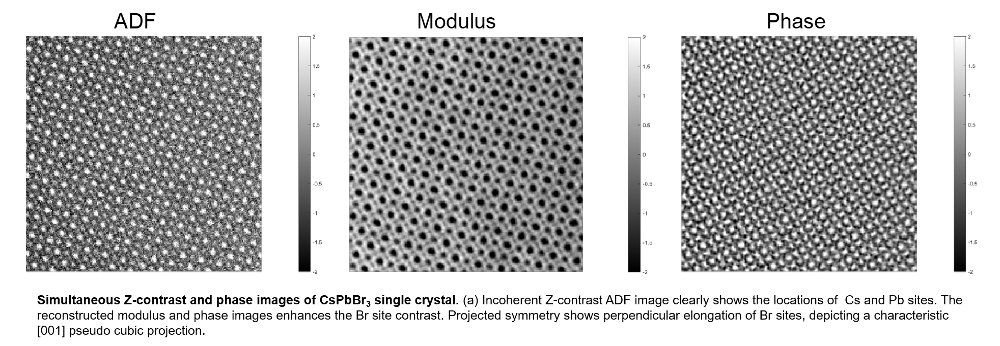

### Ptychography reconstruction
---------------

A key to the unique combination of electronic and optical properties in halide perovskite materials lies in their rich structural complexity. However, their radiation sensitive nature limits nanoscale structural characterization requiring dose efficient microscopic techniques in order to determine their structures precisely. 

In this work, we determine the space-group and directly image the Br halide sites of CsPbBr3, a promising material for optoelectronic applications

This is repository containing the analysis of ptychographic datasets used to directly image a beam sensitive material (CsPbBr3)

### Background:
-----------------

#### Halide Perovskites

  Recently, halide-based perovskites have drawn substantial interest as promising materials for high-efficiency solar energy harvesting due to their excellent optoelectronic properties, low-cost, and material accessibility.

  Most of the structural characterization studies in halide perovskites have been performed using X-ray or neutron diffraction. Unfortunately, these techniques offer a limited spatial resolution and low sensitivity to small symmetry deviations, such as the absence of center of symmetry and effects due to small atomic shifts.

  For atomic resolution low dose imaging, we use electron ptychography, which is known for providing a quantitative measure of the phase changes of the incident coherent electron wave as it propagates through an electron transparent specimen. This technique offers a highly efficient phase contrast transfer function and excellent image contrast of light elements under low dose imaging conditions.

#### Ptychography: 

Ptychography is a computational imaging technique. A detector records an extensive data set consisting of many inference patterns obtained as an object is displaced to various positions relative to an illumination field. A computer algorithm of some type is then used to invert these data into an image. 

For a very detailed review on ptychography I recommend the following paper:

Rodenburg, John M. 

"Ptychography and related diffractive imaging methods." 

Advances in imaging and electron physics 150 (2008): 87-184.

### Experimental Dataset:
-----------------
Electron diffraction patterns at each probe position were recorded at room-temperature (≈300 K) using a Gatan K2 IS direct electron detector operated at 800 frames per second in STEM operated at 300kV with a convergence semi-angle of 17.2 mrad. 

The camera acquisition and probe scanning were synchronized using a Gatan Digiscan and STEMx software package. The simultaneous annular dark field (ADF) image was acquired with collection angles of 40–240mrad. The probe was scanned over 256 × 256 probe positions to create a 256 × 256 x 1920 × 895 four-dimensional (4D) dataset, namely, 4D-STEM. 

The final reconstruction should look similar to this 

**In case of usage of the dataset or code in this repository please cite the following paper:**

"Determination of the structural phase and octahedral rotation angle in halide perovskites"

Appl. Phys. Lett. 112, 071901 (2018); https://doi.org/10.1063/1.5017537

  

----------------

<b>Contact:</b>

<b>E-mail:</b> robertomsreis@gmail.com

<Twitter:</b> @robertomsreis
